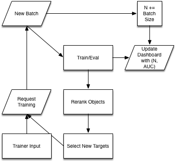

# tf-active

## overview

We'll build on the transfer learning example in the [Cloud Datalab Quickstart](https://cloud.google.com/datalab/docs/quickstarts)
to illustrate how new object classes can be introduced and learned iteratively,
with the learner following an active learning strategy, and with input provided
by a human trainer.

Here's a schematic:

## resources

* [https://codelabs.developers.google.com/codelabs/cloud-ml-engine-image-classification/](https://codelabs.developers.google.com/codelabs/cloud-ml-engine-image-classification/)

* [https://cloud.google.com/ml-engine/docs/how-tos/getting-started-training-prediction](https://cloud.google.com/ml-engine/docs/how-tos/getting-started-training-prediction)

* [https://cloud.google.com/storage/docs/quickstart-gsutil](https://cloud.google.com/storage/docs/quickstart-gsutil)

* [https://www.timo-ernst.net/blog/2015/04/03/tindercards-js/](https://www.timo-ernst.net/blog/2015/04/03/tindercards-js/)

* OLD [https://codelabs.developers.google.com/codelabs/tensorflow-for-poets/](https://codelabs.developers.google.com/codelabs/tensorflow-for-poets/)
